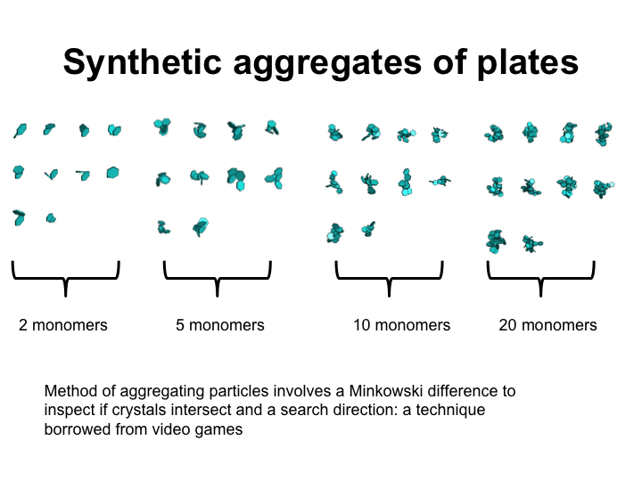

# Monte-Carlo Capacitance Model

The Monte-Carlo Capacitance Model (MCM) is a set of scripts based on 'walk-on-spheres' algorithm for solving Laplace's equation. A paper by Westbrook (2008, see paper directory, which cites it) showed some applications of such a scheme. However, the script presented here solve the equations in a more rigorous way.

Ice-aggregates in Earth's atmosphere are difficult to quantify from observations alone. The approach here is to generate synthetic aggregates on a computer and calculate their properties (see Figure below).

# Table of contents
1. [Overview](#overview)
2. [Examples](#examples)
3. [Comparison to data](#data)
5. [Capacitance calculations](#capacitance)
6. [Code of Conduct](#Code-of-Conduct)

## Overview 

<em>Some synthetically generated aggregates and important properties</em>

## Examples generated aggregates 

These scripts have been used to generate aggregates of plates and columns. 

<em>Above: synthetically generated aggregates of plates</em>

<em>Above: synthetically generated aggregates of columns</em>

## Comparison to data 

The aggregate properties have been compared statistically to observations in anvil clouds. It can be seen that their properties approximate real aggregates (see below)

<em>A 2-D histogram of the so-called "Area ratio" of observed crystals, compared to the synthetic aggregates.</em>

## Capacitance calculations 

The scripts can also calculate the capacitance of each aggregate, which is important for determining growth rates of ice crystals in Earth's atmosphere.

<em>Ratio of the capacitance to the maximum dimension.</em>

## Contributing

Contributions to MCM are more than welcome. This project was started as part of an MPhys (Masters in Physics) project and can easily be improved. I am very happy to discuss ideas for improvement and how to add/remove features.  

Please use the issue tracker at https://github.com/UoM-maul1609/monte-carlo-capacitance-model/issues if you want to notify me of an issue or need support. If you want to contribute, please either create an issue or make a pull request. Alternatively, come and see me in Manchester and/or lets meet for a coffee and a chat!

## Code of Conduct

To be arranged.